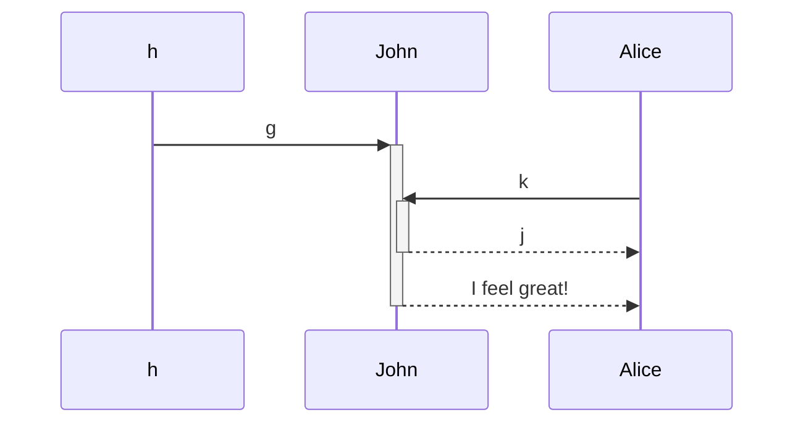
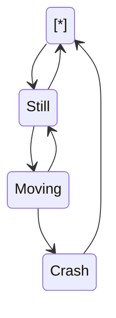

<!--MERMAID {width:100}-->

<!--MCONTENT {content: "sequenceDiagram \nh->>+John: g \nAlice->>+John: k \nJohn\\-\\-\\>>-Alice: j \nJohn\\-\\-\\>>-Alice: I feel great! \n "} --->

 

<!--MERMAID {width:50}-->

<!--MCONTENT {content: "stateDiagram-v2 \n\\[\\*\\] \\-\\-\\> Still \nStill \\-\\-\\> \\[\\*\\] \nStill \\-\\-\\> Moving \nMoving \\-\\-\\> Still \nMoving \\-\\-\\> Crash \nCrash \\-\\-\\> \\[\\*\\] "} --->

 

<!--MERMAID {width:25}-->

<!--MCONTENT {content: "stateDiagram-v2 \n\\[\\*\\] \\-\\-\\> Still \nStill \\-\\-\\> \\[\\*\\] \nStill \\-\\-\\> Moving \nMoving \\-\\-\\> Still \nMoving \\-\\-\\> Crash \nCrash \\-\\-\\> \\[\\*\\] "} --->

 

<!--MERMAID {width:100}-->

<!--MCONTENT {content: "stateDiagram-v2 \n\\[\\*\\] \\-\\-\\> Still \nStill \\-\\-\\> \\[\\*\\] \nStill \\-\\-\\> Moving \nMoving \\-\\-\\> Still \nMoving \\-\\-\\> Crash \nCrash \\-\\-\\> \\[\\*\\] "} --->

 

This file was generated by Swimm. [Click here to view it in the app](https://swimm-web-app.web.app/repos/Z2l0aHViJTNBJTNBTm9hUmVwbyUzQSUzQU5vYW96ZXI=/docs/2b9fg).
