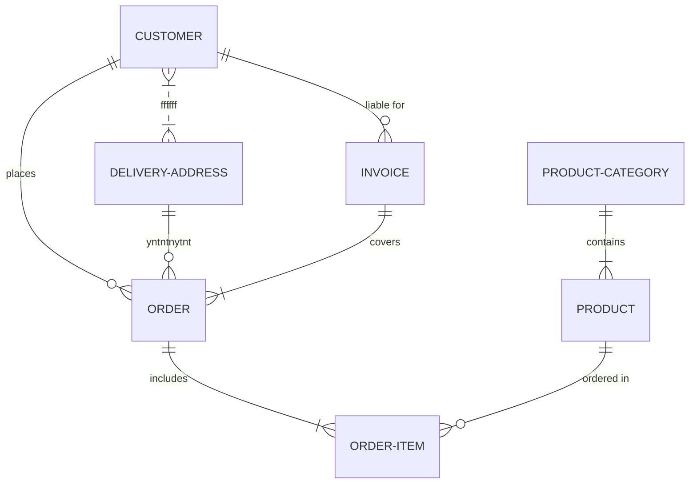
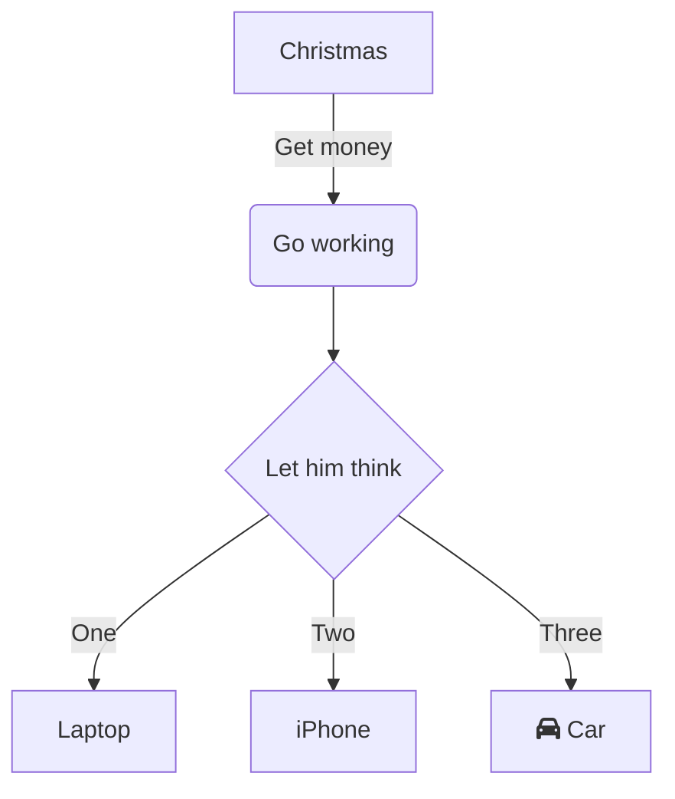

<!--MERMAID {width:100}-->

<!--MCONTENT {content: "erDiagram \nCUSTOMER }|..|{ DELIVERY-ADDRESS : ffffff \nCUSTOMER ||--o{ ORDER : places \nCUSTOMER ||--o{ INVOICE : \"liable for\" \nDELIVERY-ADDRESS ||--o{ ORDER : yntntnytnt \nINVOICE ||--|{ ORDER : covers \nORDER ||--|{ ORDER-ITEM : includes \nPRODUCT-CATEGORY ||--|{ PRODUCT : contains \nPRODUCT ||--o{ ORDER-ITEM : \"ordered in\" "} --->

 

<!--MERMAID {width:100}-->

<!--MCONTENT {content: "graph TD \nA\\[Christmas\\] \\-\\-\\>|Get money| B(Go working) \nB \\-\\-\\> C{Let him think} \nC \\-\\-\\>|One| D\\[Laptop\\] \nC \\-\\-\\>|Two| E\\[iPhone\\] \nC \\-\\-\\>|Three| F\\[fa:fa-car Car\\] \n "} --->

 

This file was generated by Swimm. [Click here to view it in the app](https://swimm-web-app.web.app/repos/Z2l0aHViJTNBJTNBTm9hUmVwbyUzQSUzQU5vYW96ZXI=/docs/2b9fg).
