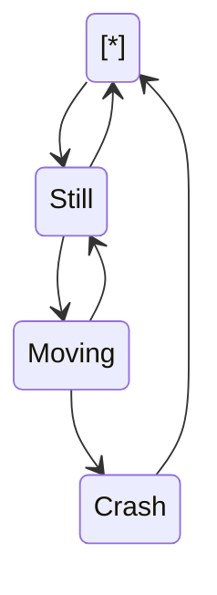

<!--MERMAID {width:100}-->
```mermaid
sequenceDiagram
h->>+John: `GitHub`
Alice->>+John: `5db5`
John-->>-Alice: `repo`
John-->>-Alice: I feel great!
sequenceDiagram
h->>+John: `GitHub`
Alice->>+John: `5db5`

```
<!--MCONTENT {content: "sequenceDiagram<br/>\nh->>+John: `GitHub`<swm-token data-swm-token=\":docusaurus.config.js:10:15:15:`  organizationName: &#39;Cyberdyne&#39;, // Usually your GitHub org/user name.`\"/><br/>\nAlice->>+John: `5db5`<swm-token data-swm-token=\":docusaurus.config.js:15:35:35:`        src: &#39;https://firebasestorage.googleapis.com/v0/b/swimmio/o/Docusaurus%2Flogo.png?alt=media&amp;token=ec1e095a-5db5-4546-ae19-a2296fe2fb6e&#39;,`\"/><br/>\nJohn\\-\\-\\>>-Alice: `repo`<swm-token data-swm-token=\":docusaurus.config.js:11:15:15:`  projectName: &#39;skynet&#39;, // Usually your repo name.`\"/><br/>\nJohn\\-\\-\\>>-Alice: I feel great!<br/>\nsequenceDiagram<br/>\nh->>+John: `GitHub`<swm-token data-swm-token=\":docusaurus.config.js:10:15:15:`  organizationName: &#39;Cyberdyne&#39;, // Usually your GitHub org/user name.`\"/><br/>\nAlice->>+John: `5db5`<swm-token data-swm-token=\":docusaurus.config.js:15:35:35:`        src: &#39;https://firebasestorage.googleapis.com/v0/b/swimmio/o/Docusaurus%2Flogo.png?alt=media&amp;token=ec1e095a-5db5-4546-ae19-a2296fe2fb6e&#39;,`\"/><br/>\n<br/>"} --->

<br/>

sequenceDiagram<br/>
h->>+John: `GitHub`<swm-token data-swm-token=":docusaurus.config.js:10:15:15:`  organizationName: &#39;Cyberdyne&#39;, // Usually your GitHub org/user name.`"/><br/>
Alice->>+John: `5db5`<swm-token data-swm-token=":docusaurus.config.js:15:35:35:`        src: &#39;https://firebasestorage.googleapis.com/v0/b/swimmio/o/Docusaurus%2Flogo.png?alt=media&amp;token=ec1e095a-5db5-4546-ae19-a2296fe2fb6e&#39;,`"/>

<br/>

<!--MERMAID {width:50}-->
```mermaid
sequenceDiagram
h->>+John: `GitHub`
Alice->>+John: `5db5`
stateDiagram-v2
[\*] --> Still
Still --> [\*]
Still --> Moving
Moving --> Still
Moving --> Crash
Crash --> [\*]
```
<!--MCONTENT {content: "sequenceDiagram<br/>\nh->>+John: `GitHub`<swm-token data-swm-token=\":docusaurus.config.js:10:15:15:`  organizationName: &#39;Cyberdyne&#39;, // Usually your GitHub org/user name.`\"/><br/>\nAlice->>+John: `5db5`<swm-token data-swm-token=\":docusaurus.config.js:15:35:35:`        src: &#39;https://firebasestorage.googleapis.com/v0/b/swimmio/o/Docusaurus%2Flogo.png?alt=media&amp;token=ec1e095a-5db5-4546-ae19-a2296fe2fb6e&#39;,`\"/><br/>\nstateDiagram-v2<br/>\n\\[\\*\\] \\-\\-\\> Still<br/>\nStill \\-\\-\\> \\[\\*\\]<br/>\nStill \\-\\-\\> Moving<br/>\nMoving \\-\\-\\> Still<br/>\nMoving \\-\\-\\> Crash<br/>\nCrash \\-\\-\\> \\[\\*\\]<br/>"} --->

<br/>

<!--MERMAID {width:25}-->

<!--MCONTENT {content: "stateDiagram-v2<br/>\n\\[\\*\\] \\-\\-\\> Still<br/>\nStill \\-\\-\\> \\[\\*\\]<br/>\nStill \\-\\-\\> Moving<br/>\nMoving \\-\\-\\> Still<br/>\nMoving \\-\\-\\> Crash<br/>\nCrash \\-\\-\\> \\[\\*\\]<br/>"} --->

<br/>

<!--MERMAID {width:100}-->

<!--MCONTENT {content: "stateDiagram-v2<br/>\n\\[\\*\\] \\-\\-\\> Still<br/>\nStill \\-\\-\\> \\[\\*\\]<br/>\nStill \\-\\-\\> Moving<br/>\nMoving \\-\\-\\> Still<br/>\nMoving \\-\\-\\> Crash<br/>\nCrash \\-\\-\\> \\[\\*\\]<br/>"} --->

<br/>

<!--MERMAID {width:100}-->

<!--MCONTENT {content: "stateDiagram-v2<br/>\n\\[\\*\\] \\-\\-\\> Still<br/>\nStill \\-\\-\\> \\[\\*\\]<br/>\nStill \\-\\-\\> Moving<br/>\nMoving \\-\\-\\> Still<br/>\nMoving \\-\\-\\> Crash<br/>\nCrash \\-\\-\\> \\[\\*\\]<br/>"} --->

<br/>

|<br/>|
|-----|

<br/>

<!--MERMAID {width:100}-->

<!--MCONTENT {content: "stateDiagram-v2<br/>\n\\[\\*\\] \\-\\-\\> Still<br/>\nStill \\-\\-\\> \\[\\*\\]<br/>\nStill \\-\\-\\> Moving<br/>\nMoving \\-\\-\\> Still<br/>\nMoving \\-\\-\\> Crash<br/>\nCrash \\-\\-\\> \\[\\*\\]<br/>"} --->

<br/>

|<br/>|<br/>|
|-----|-----|
|<br/>|<br/>|

<br/>

<!--MERMAID {width:100}-->

<!--MCONTENT {content: "stateDiagram-v2<br/>\n\\[\\*\\] \\-\\-\\> Still<br/>\nStill \\-\\-\\> \\[\\*\\]<br/>\nStill \\-\\-\\> Moving<br/>\nMoving \\-\\-\\> Still<br/>\nMoving \\-\\-\\> Crash<br/>\nCrash \\-\\-\\> \\[\\*\\]<br/>"} --->

<br/>

hey its hey its hey its hey its hey its hey its hey its hey its hey its hey its hey its hey its hey its hey its hey its hey its hey its hey its hey its hey its hey its hey its hey its hey its hey its hey its hey its hey its hey its hey its hey its hey its hey its hey its hey its hey its hey its hey its

<br/>

hey its hey its hey its hey its hey its hey its hey its hey its hey its hey its hey its hey its hey its hey its hey its hey its hey its hey its hey its hey its hey its hey its hey its hey its hey its hey its hey its hey its<br/>
hey its<br/>
hey its hey its hey its hey its hey its hey its hey its hey its
<!-- NOTE-swimm-snippet: the lines below link your snippet to Swimm -->
### 📄 src/css/custom.css
```css
7      
8      /* You can override the default Infima variables here. */
9      :root {
10       --ifm-color-primary: #25c2a0;
11       --ifm-color-primary-dark: rgb(33, 175, 144);
12       --ifm-color-primary-darker: rgb(31, 165, 136);
13       --ifm-color-primary-darkest: rgb(26, 136, 112);
14       --ifm-color-primary-light: rgb(70, 203, 174);
15       --ifm-color-primary-lighter: rgb(102, 212, 189);
16       --ifm-color-primary-lightest: rgb(146, 224, 208);
17       --ifm-code-font-size: 95%;
18     }
19     
20     .docusaurus-highlight-code-line {
```

<br/>

hey its hey its hey its hey its hey its hey its hey its hey its hey its hey its hey its hey its hey its hey its hey its hey its hey its hey its hey its hey its hey its hey its hey its hey its hey its hey its hey its hey its hey its

<br/>

This file was generated by Swimm. [Click here to view it in the app](https://swimm-web-app.web.app/repos/Z2l0aHViJTNBJTNBTm9hUmVwbyUzQSUzQU5vYW96ZXI=/docs/2b9fg).
