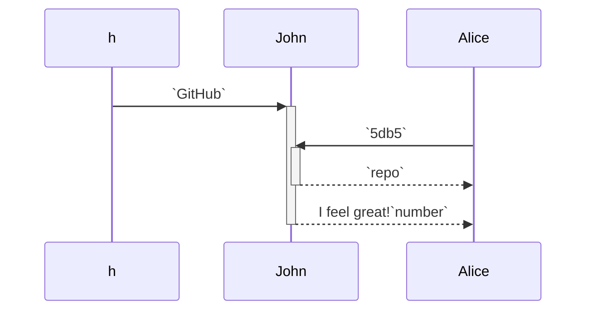

<!--MERMAID {width:100}-->

<!--MCONTENT {content: "sequenceDiagram \nh->>+John: `GitHub`<swm-token data-swm-token=\":docusaurus.config.js:10:15:15:`  organizationName: &#39;Cyberdyne&#39;, // Usually your GitHub org/user name.`\"/> \nAlice->>+John: `5db5`<swm-token data-swm-token=\":docusaurus.config.js:16:35:35:`        src: &#39;https://firebasestorage.googleapis.com/v0/b/swimmio/o/Docusaurus%2Flogo.png?alt=media&amp;token=ec1e095a-5db5-4546-ae19-a2296fe2fb6e&#39;,`\"/> \nJohn\\-\\-\\>>-Alice: `repo`<swm-token data-swm-token=\":docusaurus.config.js:11:15:15:`  projectName: &#39;skynet&#39;, // Usually your repo name.`\"/> \nJohn\\-\\-\\>>-Alice: I feel great!`number`<swm-token data-swm-token=\":docusaurus.config.js:13:1:1:`    number: {`\"/> \n "} --->

 

<!--MERMAID {width:50}-->

<!--MCONTENT {content: "stateDiagram-v2 \n\\[\\*\\] \\-\\-\\> Still \nStill \\-\\-\\> \\[\\*\\] \nStill \\-\\-\\> Moving \nMoving \\-\\-\\> Still \nMoving \\-\\-\\> Crash \nCrash \\-\\-\\> \\[\\*\\] "} --->

 

<!--MERMAID {width:25}-->

<!--MCONTENT {content: "stateDiagram-v2 \n\\[\\*\\] \\-\\-\\> Still \nStill \\-\\-\\> \\[\\*\\] \nStill \\-\\-\\> Moving \nMoving \\-\\-\\> Still \nMoving \\-\\-\\> Crash \nCrash \\-\\-\\> \\[\\*\\] "} --->

 

<!--MERMAID {width:100}-->

<!--MCONTENT {content: "stateDiagram-v2 \n\\[\\*\\] \\-\\-\\> Still \nStill \\-\\-\\> \\[\\*\\] \nStill \\-\\-\\> Moving \nMoving \\-\\-\\> Still \nMoving \\-\\-\\> Crash \nCrash \\-\\-\\> \\[\\*\\] "} --->

 

This file was generated by Swimm. [Click here to view it in the app](https://swimm-web-app.web.app/repos/Z2l0aHViJTNBJTNBTm9hUmVwbyUzQSUzQU5vYW96ZXI=/docs/2b9fg).
