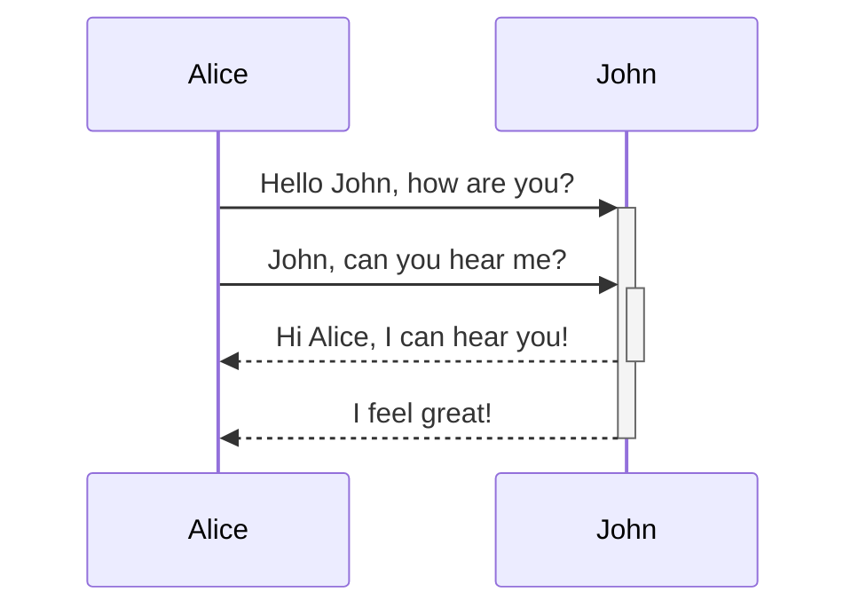

# test 1
<!-- NOTE-swimm-snippet: the lines below link your snippet to Swimm -->
### 📄 package.json
```json
2        "name": "docusaurus-template",
3        "version": "0.0.0",
4        "private": true,
5        "scripts": {
6          "docusaurus": "docusaurus",
7          "start": "docusaurus start",
8          "build": "docusaurus build",
9          "swizzle": "docusaurus swizzle",
10         "deploy": "docusaurus deploy",
11         "clear": "docusaurus clear",
12         "serve": "docusaurus serve",
13         "write-translations": "docusaurus write-translations",
14         "write-heading-ids": "docusaurus write-heading-ids"
15       },
```

<br/>

|table 1|<br/>|<br/>|<br/>|
|-------|-----|-----|-----|
|<br/>  |<br/>|<br/>|<br/>|

<br/>

## test 2
<!-- NOTE-swimm-snippet: the lines below link your snippet to Swimm -->
### 📄 docusaurus.config.js
```javascript
1      /** @type {import('@docusaurus/types').DocusaurusConfig} */
2      module.exports = {
3        title: 'Swimm Documentation',
4        tagline: 'Built With Docusaurus',
5        url: 'https://your-docusaurus-test-site.com',
6        baseUrl: '/',
7        onBrokenLinks: 'warn',
8        onBrokenMarkdownLinks: 'warn',
9        favicon: 'img/favicon.ico',
10       organizationName: 'Cyberdyne', // Usually your GitHub org/user name.
11       projectName: 'skynet', // Usually your repo name.
12       themeConfig: {
13         navbar: {
14           logo: {
15             alt: 'Swimm',
16             src: 'https://firebasestorage.googleapis.com/v0/b/swimmio/o/Docusaurus%2Flogo.png?alt=media&token=ec1e095a-5db5-4546-ae19-a2296fe2fb6e',
```

<br/>

<!--MERMAID {width:100}-->

<!--MCONTENT {content: "sequenceDiagram<br/>\nAlice->>+John: Hello John, how are you?<br/>\nAlice->>+John: John, can you hear me?<br/>\nJohn\\-\\-\\>>-Alice: Hi Alice, I can hear you!<br/>\nJohn\\-\\-\\>>-Alice: I feel great!<br/>\n<br/>"} --->

<br/>

# test 3
<!-- NOTE-swimm-snippet: the lines below link your snippet to Swimm -->
### 📄 sidebars.js
```javascript
4       - render a sidebar for each doc of that group
5       - provide next/previous navigation
6      
7       The sidebars can be generated from the filesystem, or explicitly defined here.
8      
9       Create as many sidebars as you want.
10      */
11     
12     module.exports = {
13       // By default, Docusaurus generates a sidebar from the docs folder structure
14       tutorialSidebar: [{type: 'autogenerated', dirName: '.'}],
15     
16       // But you can create a sidebar manually
17       /*
18       tutorialSidebar: [
19         {
20           type: 'category',
21           label: 'Tutorial',
22           items: ['hello'],
23         },
24       ],
25        */
26     };
27     
```

<br/>

<div align="center"></div>

<br/>

# test 5
<!-- NOTE-swimm-snippet: the lines below link your snippet to Swimm -->
<!-- NOTE-swimm-repo ::dummy-repo:: -->
### 📄 bower_components/bootstrap/grunt/bs-lessdoc-parser.js
```javascript
1      /*!
2       * Bootstrap Grunt task for parsing Less docstrings
3       * http://getbootstrap.com
4       * Copyright 2014 Twitter, Inc.
5       * Licensed under MIT (https://github.com/twbs/bootstrap/blob/master/LICENSE)
6       */
7      'use strict';
8      
9      var markdown = require('markdown').markdown;
10     
11     function markdown2html(markdownString) {
12       // the slice removes the <p>...</p> wrapper output by Markdown processor
13       return markdown.toHTML(markdownString.trim()).slice(3, -4);
14     }
15     
16     
17     /*
18     Mini-language:
19       //== This is a normal heading, which starts a section. Sections group variables together.
20       //## Optional description for the heading
21     
22       //=== This is a subheading.
23     
24       //** Optional description for the following variable. You **can** use Markdown in descriptions to discuss `<html>` stuff.
25       @foo: #fff;
26     
27       //-- This is a heading for a section whose variables shouldn't be customizable
28     
29       All other lines are ignored completely.
30     */
31     
32     
33     var CUSTOMIZABLE_HEADING = /^[/]{2}={2}(.*)$/;
34     var UNCUSTOMIZABLE_HEADING = /^[/]{2}-{2}(.*)$/;
35     var SUBSECTION_HEADING = /^[/]{2}={3}(.*)$/;
36     var SECTION_DOCSTRING = /^[/]{2}#{2}(.*)$/;
37     var VAR_ASSIGNMENT = /^(@[a-zA-Z0-9_-]+):[ ]*([^ ;][^;]+);[ ]*$/;
38     var VAR_DOCSTRING = /^[/]{2}[*]{2}(.*)$/;
39     
40     function Section(heading, customizable) {
41       this.heading = heading.trim();
42       this.id = this.heading.replace(/\s+/g, '-').toLowerCase();
43       this.customizable = customizable;
44       this.docstring = null;
45       this.subsections = [];
46     }
47     
48     Section.prototype.addSubSection = function (subsection) {
49       this.subsections.push(subsection);
50     };
51     
52     function SubSection(heading) {
53       this.heading = heading.trim();
54       this.id = this.heading.replace(/\s+/g, '-').toLowerCase();
55       this.variables = [];
56     }
57     
58     SubSection.prototype.addVar = function (variable) {
59       this.variables.push(variable);
60     };
61     
62     function VarDocstring(markdownString) {
63       this.html = markdown2html(markdownString);
64     }
65     
66     function SectionDocstring(markdownString) {
67       this.html = markdown2html(markdownString);
68     }
69     
70     function Variable(name, defaultValue) {
71       this.name = name;
72       this.defaultValue = defaultValue;
73       this.docstring = null;
74     }
75     
76     function Tokenizer(fileContent) {
77       this._lines = fileContent.split('\n');
78       this._next = undefined;
79     }
80     
81     Tokenizer.prototype.unshift = function (token) {
82       if (this._next !== undefined) {
83         throw new Error('Attempted to unshift twice!');
84       }
85       this._next = token;
86     };
87     
88     Tokenizer.prototype._shift = function () {
89       // returning null signals EOF
90       // returning undefined means the line was ignored
91       if (this._next !== undefined) {
92         var result = this._next;
93         this._next = undefined;
94         return result;
95       }
96       if (this._lines.length <= 0) {
97         return null;
98       }
99       var line = this._lines.shift();
100      var match = null;
101      match = SUBSECTION_HEADING.exec(line);
102      if (match !== null) {
103        return new SubSection(match[1]);
104      }
105      match = CUSTOMIZABLE_HEADING.exec(line);
106      if (match !== null) {
107        return new Section(match[1], true);
108      }
109      match = UNCUSTOMIZABLE_HEADING.exec(line);
110      if (match !== null) {
111        return new Section(match[1], false);
112      }
113      match = SECTION_DOCSTRING.exec(line);
114      if (match !== null) {
115        return new SectionDocstring(match[1]);
116      }
117      match = VAR_DOCSTRING.exec(line);
118      if (match !== null) {
119        return new VarDocstring(match[1]);
120      }
121      var commentStart = line.lastIndexOf('//');
122      var varLine = (commentStart === -1) ? line : line.slice(0, commentStart);
123      match = VAR_ASSIGNMENT.exec(varLine);
124      if (match !== null) {
125        return new Variable(match[1], match[2]);
126      }
127      return undefined;
128    };
129    
130    Tokenizer.prototype.shift = function () {
131      while (true) {
132        var result = this._shift();
133        if (result === undefined) {
134          continue;
135        }
136        return result;
137      }
138    };
139    
140    function Parser(fileContent) {
141      this._tokenizer = new Tokenizer(fileContent);
142    }
143    
144    Parser.prototype.parseFile = function () {
145      var sections = [];
146      while (true) {
147        var section = this.parseSection();
148        if (section === null) {
149          if (this._tokenizer.shift() !== null) {
150            throw new Error('Unexpected unparsed section of file remains!');
151          }
152          return sections;
153        }
154        sections.push(section);
155      }
156    };
157    
158    Parser.prototype.parseSection = function () {
159      var section = this._tokenizer.shift();
160      if (section === null) {
161        return null;
162      }
163      if (!(section instanceof Section)) {
164        throw new Error('Expected section heading; got: ' + JSON.stringify(section));
165      }
166      var docstring = this._tokenizer.shift();
167      if (docstring instanceof SectionDocstring) {
168        section.docstring = docstring;
169      }
170      else {
171        this._tokenizer.unshift(docstring);
172      }
173      this.parseSubSections(section);
174    
175      return section;
176    };
177    
178    Parser.prototype.parseSubSections = function (section) {
179      while (true) {
180        var subsection = this.parseSubSection();
181        if (subsection === null) {
182          if (section.subsections.length === 0) {
183            // Presume an implicit initial subsection
184            subsection = new SubSection('');
185            this.parseVars(subsection);
186          }
187          else {
188            break;
189          }
190        }
191        section.addSubSection(subsection);
192      }
193    
194      if (section.subsections.length === 1 && !(section.subsections[0].heading) && section.subsections[0].variables.length === 0) {
195        // Ignore lone empty implicit subsection
196        section.subsections = [];
197      }
198    };
199    
200    Parser.prototype.parseSubSection = function () {
201      var subsection = this._tokenizer.shift();
202      if (subsection instanceof SubSection) {
203        this.parseVars(subsection);
204        return subsection;
205      }
206      this._tokenizer.unshift(subsection);
207      return null;
208    };
209    
210    Parser.prototype.parseVars = function (subsection) {
211      while (true) {
212        var variable = this.parseVar();
213        if (variable === null) {
214          return;
215        }
216        subsection.addVar(variable);
217      }
218    };
219    
220    Parser.prototype.parseVar = function () {
221      var docstring = this._tokenizer.shift();
222      if (!(docstring instanceof VarDocstring)) {
223        this._tokenizer.unshift(docstring);
224        docstring = null;
225      }
226      var variable = this._tokenizer.shift();
227      if (variable instanceof Variable) {
228        variable.docstring = docstring;
229        return variable;
230      }
231      this._tokenizer.unshift(variable);
232      return null;
233    };
234    
235    
236    module.exports = Parser;
```

<br/>

### test 4
<!-- NOTE-swimm-snippet: the lines below link your snippet to Swimm -->
<!-- NOTE-swimm-repo ::dummy-repo:: -->
### 📄 cypress/integration/spec.js
```javascript
28     
29           CYPRESS_framework=angular-dart/web cypress open
30       `
31       )
32     }
33     
34     const frameworkFolders = {
35       ampersand: 'ampersand/',
36       'angular-dart': 'angular-dart/web',
37       'chaplin-brunch': 'chaplin-brunch/public',
38       duel: 'duel/www',
39     }
40     const getExampleFolder = framework => frameworkFolders[framework] || framework
41     
42     const noLocalStorageCheck = {
43       backbone: true,
44       backbone_marionette: true,
45       backbone_require: true,
46       knockback: true,
47       flight: true,
48       serenadejs: true,
49       js_of_ocaml: true,
50       reagent: true,
51       rappidjs: true,
52       exoskeleton: true,
53       'react-backbone': true,
54       puremvc: true,
55       'typescript-backbone': true,
56       enyo_backbone: true,
57       foam: true
58     }
59     
60     const noLocalStorageSpyCheck = {
61       canjs: true,
62       canjs_require: true
63     }
64     
65     const noAppStartCheck = {
66       mithril: true
67     }
68     
69     // usually when an app makes localStorage.setItem call we think
70     // it is ready to work. But some apps are so slow, that the DOM
71     // is well behind the data model. For these apps, do not consider
72     // intercepted localStorage.setItem a signal
73     const storageSetDoesNotMeanAppStarted = {
74       flight: true,
75       olives: true
76     }
77     
78     // some apps serialize data in such a bad way that we cannot
79     // check localStorage for keywords like "complete" or "isComplete"
80     const badLocalStorageFormat = {
81       js_of_ocaml: true
82     }
83     
84     // some frameworks really rely on "blur" event
85     // to know when typing has finished
86     const blurAfterType = {
87       ampersand: true,
88       dijon: true,
89       duel: true,
90       jquery: true,
91       vanillajs: true,
92       'vanilla-es6': true
93     }
94     
95     // add after typing if `...{enter}` is not enough for some frameworks
96     // cy.type('{enter}').then(safeBlur)
97     const safeBlur = $el => {
98       if (blurAfterType[framework]) {
99         const event = new Event('blur', {force: true})
100        $el.get(0).dispatchEvent(event)
101      }
102    }
103    
104    // Some frameworks need to avoid runtime determination of selector type.
105    const usesIDSelectors = {
106      polymer: false
107    }
108    
109    const title = `TodoMVC - ${framework}`
110    
111    function skipTestsWithKnownIssues () {
112      // TODO find how to REALLY skip tests - currently does not
113      // take suite chain into account, thus just hides the
114      // tests with known issues
115      const removeCommas = s => s.replace(/,/g, '')
116      const issueNames = knownIssues
117        .map(Cypress._.toLower)
118        .filter(name => name.includes(framework))
119        .map(removeCommas)
120      console.log('framework %s has %d issue(s)', framework, issueNames.length)
121    
122      const realIt = window.it
123      window.it = function (name, cb) {
124        if (typeof name === 'function') {
125          // using it(cb) form without title
126          cb = name
127          name = cb.name
128        }
129        if (!cb) {
130          // nothing to do - skipped test, just title
131          return
132        }
133        name = name.toLowerCase()
134        const issue = issueNames.find(issueName => issueName.endsWith(name))
135        if (issue) {
136          console.log('test "%s" has a known issue', name)
137          return realIt.skip(name, cb)
138        } else {
139          return realIt.apply(null, arguments)
140        }
141      }
142      window.it.skip = realIt.skip
143      window.it.only = realIt.only
144    }
145    skipTestsWithKnownIssues()
146    
147    // checks that local storage has an item with given text
148    const checkTodosInLocalStorage = (presentText, force) => {
149      if (noLocalStorageCheck[framework]) {
150        if (!force) {
151          return
152        }
153      }
154    
155      cy.log(`Looking for "${presentText}" in localStorage`)
156    
157      return cy.window().its('localStorage').then(storage => {
158        return new Cypress.Promise((resolve, reject) => {
159          const checkItems = () => {
160            if (storage.length < 1) {
161              return setTimeout(checkItems, 0)
162            }
163            if (
164              Object.keys(storage).some(key => {
165                return storage.getItem(key).includes(presentText)
166              })
167            ) {
168              return resolve()
169            }
170            setTimeout(checkItems, 0)
171          }
172          checkItems()
173        })
174      })
175    }
176    
177    const checkCompletedKeywordInLocalStorage = () => {
178      if (badLocalStorageFormat[framework]) {
179        return
180      }
181    
182      cy.log(`Looking for any completed items in localStorage`)
183    
184      const variants = ['complete', 'isComplete']
185    
186      return cy.window().its('localStorage').then(storage => {
187        return new Cypress.Promise((resolve, reject) => {
188          const checkItems = () => {
189            if (storage.length < 1) {
190              return setTimeout(checkItems, 0)
191            }
192            if (
193              Object.keys(storage).some(key => {
194                const text = storage.getItem(key)
195                return variants.some(variant =>
196                  text.includes(variant)
197                )
198              })
199            ) {
200              return resolve()
201            }
202            setTimeout(checkItems, 0)
203          }
204          checkItems()
205        })
206      })
207    }
208    
209    const checkNumberOfTodosInLocalStorage = n => {
210      if (noLocalStorageCheck[framework]) {
211        return
212      }
213    
214      cy.log(`localStorage should have ${n} todo items`)
215    
216      return cy.window().its('localStorage').then(storage => {
217        return new Cypress.Promise((resolve, reject) => {
218          const checkItems = () => {
219            if (storage.length < 1) {
220              return setTimeout(checkItems, 0)
221            }
222            if (
223              Object.keys(storage).some(key => {
224                const text = storage.getItem(key)
225                // assuming it is an array
226                try {
227                  const items = JSON.parse(text)
228                  return items.length === n
229                } catch (e) {
230                  // ignore
231                  return
232                }
233              })
234            ) {
235              return resolve()
236            }
237            setTimeout(checkItems, 0)
238          }
239          checkItems()
240        })
241      })
```

<br/>

|<br/>|table 2|<br/>|
|-----|-------|-----|
|<br/>|<br/>  |<br/>|
|<br/>|<br/>  |<br/>|
|<br/>|<br/>  |<br/>|
|<br/>|<br/>  |<br/>|

<br/>

This file was generated by Swimm. [Click here to view it in the app](https://swimm-web-app--pr-13920-dlec3z3e.web.app/repos/Z2l0aHViJTNBJTNBTm9hUmVwbyUzQSUzQU5vYW96ZXI=/docs/cuw1i).
