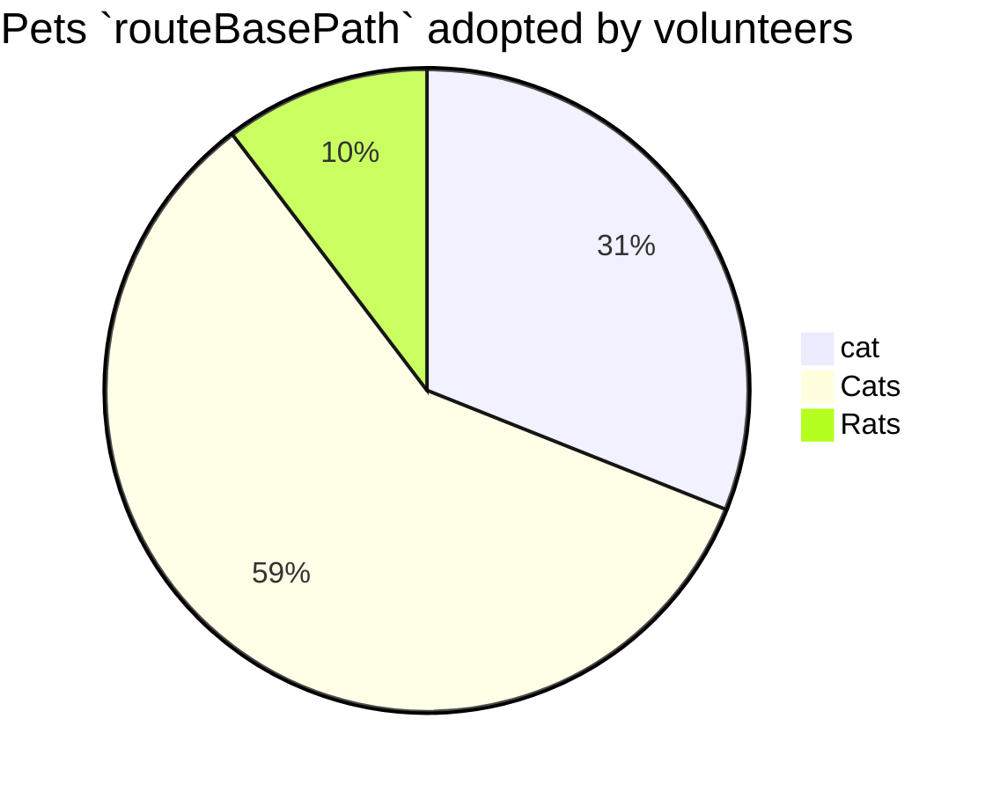

<!--MERMAID {width:100}-->

<!--MCONTENT {content: "pie title Pets `routeBasePath`<swm-token data-swm-token=\":docusaurus.config.js:26:1:1:`          routeBasePath: &#39;/&#39;,`\"/> adopted by volunteers \n\"cat\" : 45 \n\"Cats\" : 85 \n\"Rats\" : 15 \n\n "} --->

 

This file was generated by Swimm. [Click here to view it in the app](http://localhost:5000/repos/Z2l0aHViJTNBJTNBTm9hUmVwbyUzQSUzQU5vYW96ZXI=/docs/qgyhxits).
