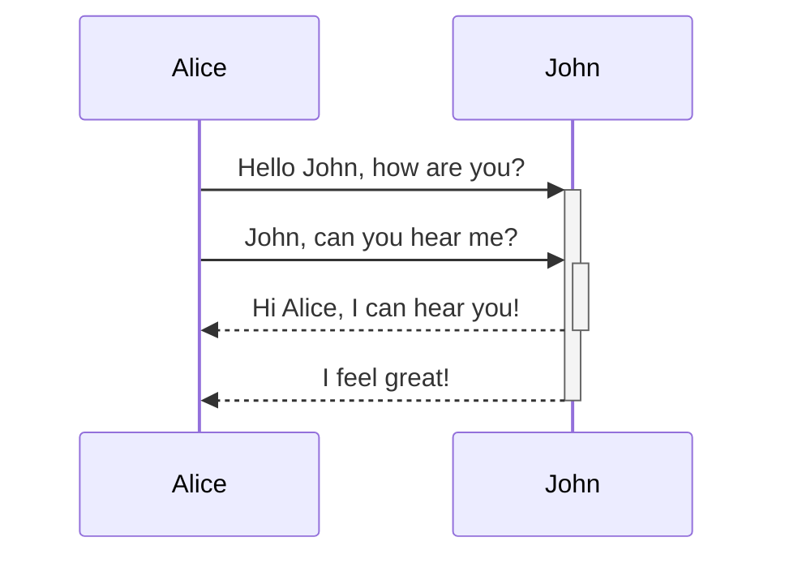

<!--MERMAID {width:25}-->

<!--MCONTENT {content: "sequenceDiagram \nAlice->>+John: Hello John, how are you? \nAlice->>+John: John, can you hear me? \nJohn\\-\\-\\>>-Alice: Hi Alice, I can hear you! \nJohn\\-\\-\\>>-Alice: I feel great! "} --->

 

This file was generated by Swimm. [Click here to view it in the app](http://localhost:5000/repos/Z2l0aHViJTNBJTNBTm9hUmVwbyUzQSUzQU5vYW96ZXI=/docs/qgyhxits).
