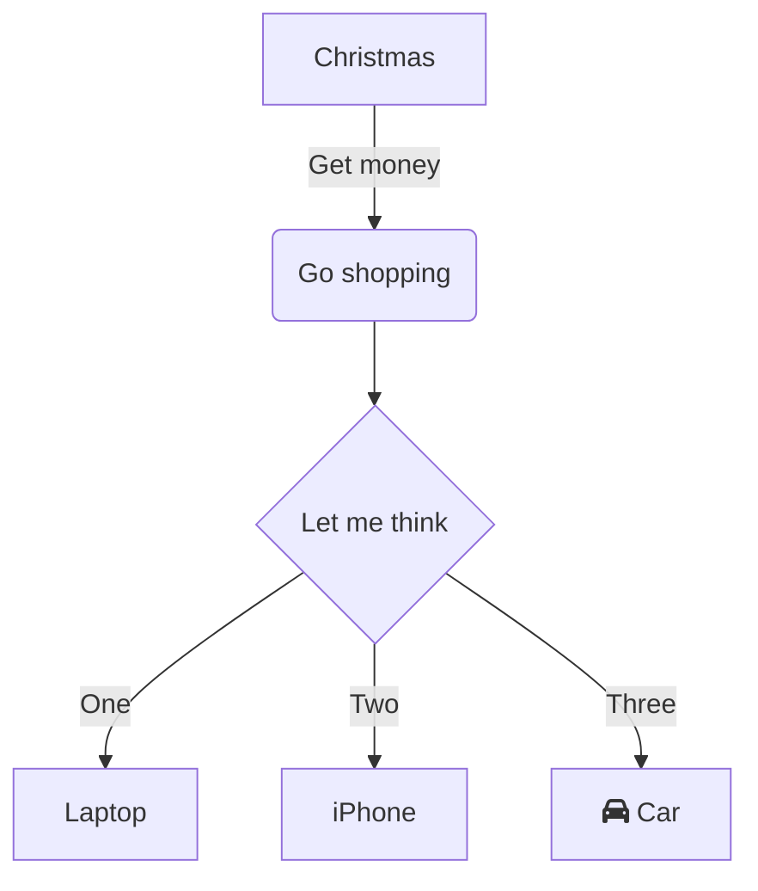

<!--MERMAID {width:100}-->

<!--MCONTENT {content: "flowchart TD \nA\\[Christmas\\] \\-\\-\\>|Get money| B(Go shopping) \nB \\-\\-\\> C{Let me think} \nC \\-\\-\\>|One| D\\[Laptop\\] \nC \\-\\-\\>|Two| E\\[iPhone\\] \nC \\-\\-\\>|Three| F\\[fa:fa-car Car\\] "} --->

 

This file was generated by Swimm. [Click here to view it in the app](http://localhost:5000/repos/Z2l0aHViJTNBJTNBTm9hUmVwbyUzQSUzQU5vYW96ZXI=/docs/qgyhxits).
