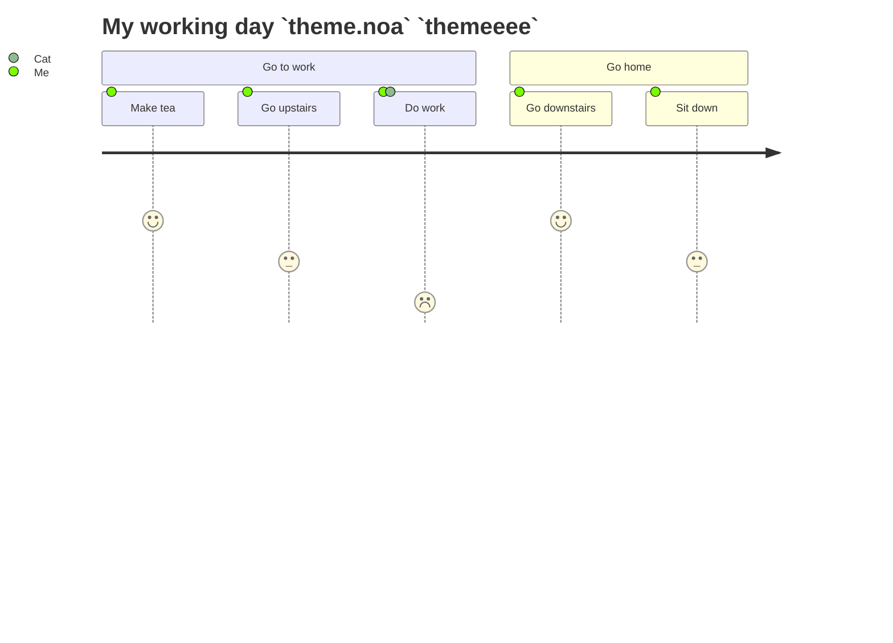

<!--MERMAID {width:100}-->

<!--MCONTENT {content: "journey \ntitle My working day `theme.noa`<swm-token data-swm-token=\":docusaurus.config.js:28:3:5:`        themeeee theme.noa themeNoa: {`\"/> `themeeee`<swm-token data-swm-token=\":docusaurus.config.js:28:1:1:`        themeeee theme.noa themeNoa: {`\"/> \nsection Go to work \nMake tea: 5: Me \nGo upstairs: 3: Me \nDo work: 1: Me, Cat \nsection Go home \nGo downstairs: 5: Me \nSit down: 3: Me \n "} --->

 

fegbg

 

This file was generated by Swimm. [Click here to view it in the app](http://localhost:5000/repos/Z2l0aHViJTNBJTNBTm9hUmVwbyUzQSUzQU5vYW96ZXI=/docs/qgyhxits).
