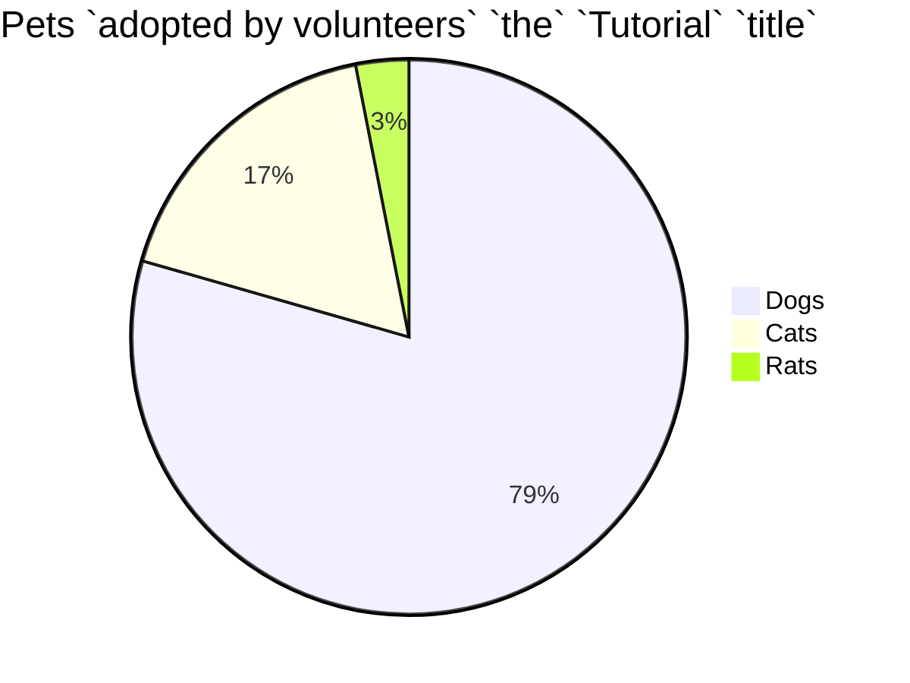

<!--MERMAID {width:25}-->

<!--MCONTENT {content: "pie title Pets `adopted by volunteers` `the`<swm-token data-swm-token=\":sidebars.js:7:13:13:` The sidebars can be generated from the filesystem, or explicitly defined here.`\"/> `Tutorial`<swm-token data-swm-token=\":sidebars.js:21:5:5:`      label: &#39;Tutorial&#39;,`\"/> `title`<swm-token data-swm-token=\":docusaurus.config.js:3:1:1:`  title: &#39;Swimm Documentation&#39;,`\"/> \n\"Dogs\" : 386 \n\"Cats\" : 85 \n\"Rats\" : 15 \n\n "} --->

 

This file was generated by Swimm. [Click here to view it in the app](https://swimm-web-app.web.app/repos/Z2l0aHViJTNBJTNBTm9hUmVwbyUzQSUzQU5vYW96ZXI=/docs/jcr8ebu7).
