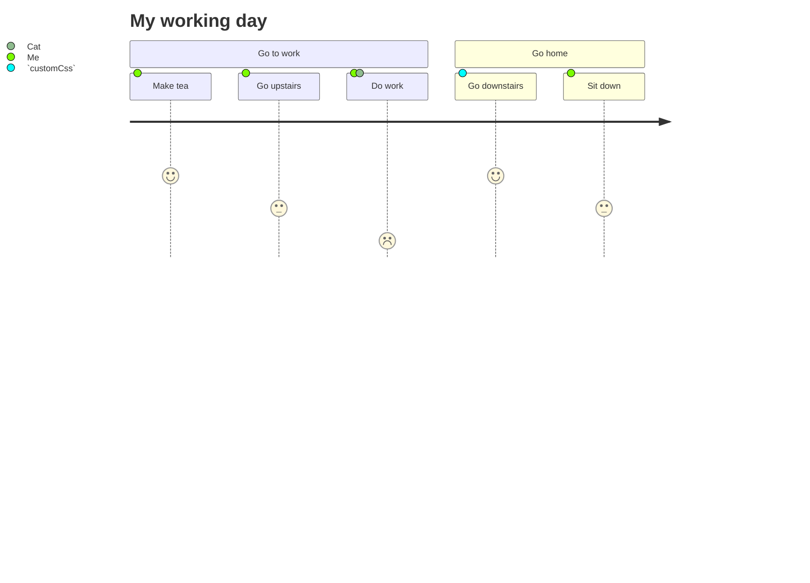

<!--MERMAID {width:100}-->

<!--MCONTENT {content: "journey \ntitle My working day \nsection Go to work \nMake tea: 5: Me \nGo upstairs: 3: Me \nDo work: 1: Me, Cat \nsection Go home \nGo downstairs: 5: `customCss`<swm-token data-swm-token=\":docusaurus.config.js:29:1:1:`          customCss: require.resolve(&#39;./src/css/custom.css&#39;),`\"/> \nSit down: 3: Me \n\n "} --->

 

This file was generated by Swimm. [Click here to view it in the app](/repos/Z2l0aHViJTNBJTNBTm9hUmVwbyUzQSUzQU5vYW96ZXI=/docs/1l0wi).
