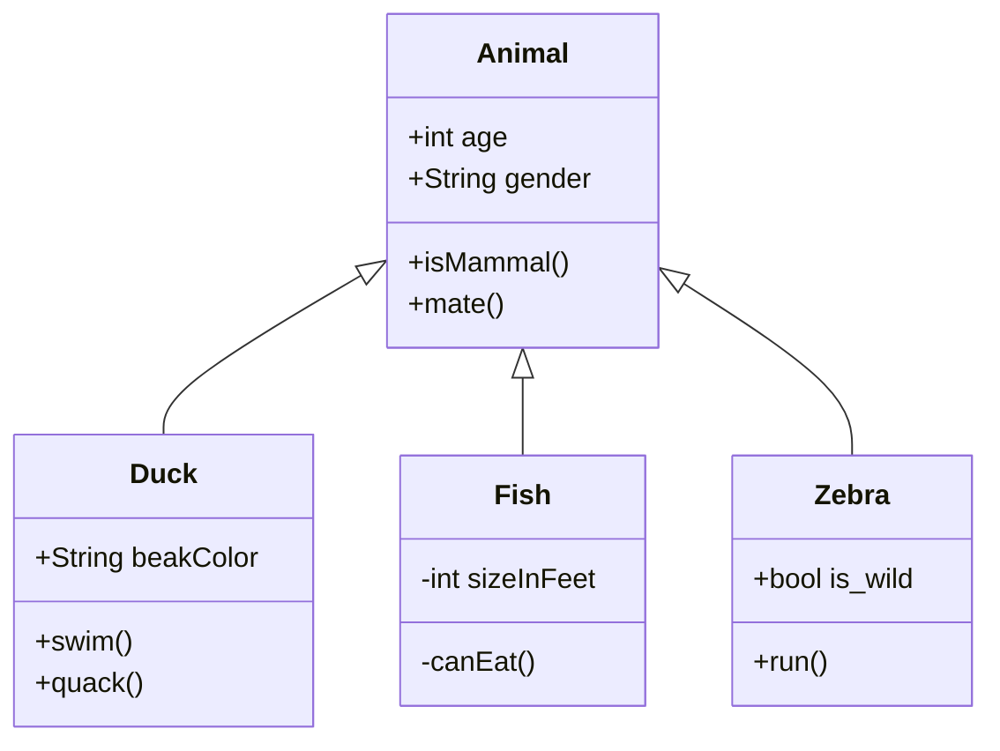
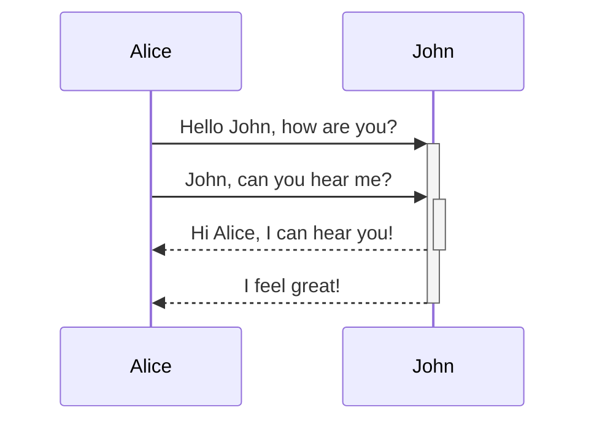
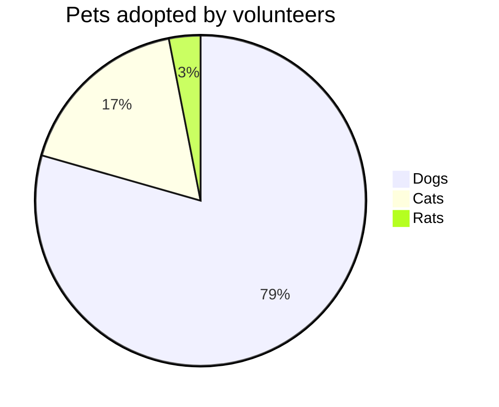

<!--MERMAID {width:100}-->

<!--MCONTENT {content: "classDiagram \nAnimal <|-- Duck \nAnimal <|-- Fish \nAnimal <|-- Zebra \nAnimal : +int age \nAnimal : +String gender \nAnimal: +isMammal() \nAnimal: +mate() \nclass Duck{ \n+String beakColor \n+swim() \n+quack() \n} \nclass Fish{ \n\\-int sizeInFeet \n\\-canEat() \n} \nclass Zebra{ \n+bool is\\_wild \n+run() \n} \n\n "} --->

 

<!--MERMAID {width:100}-->

<!--MCONTENT {content: "sequenceDiagram \nAlice->>+John: Hello John, how are you? \nAlice->>+John: John, can you hear me? \nJohn\\-\\-\\>>-Alice: Hi Alice, I can hear you! \nJohn\\-\\-\\>>-Alice: I feel great! \n\n "} --->

 

<!--MERMAID {width:100}-->

<!--MCONTENT {content: "pie title Pets adopted by volunteers \n\"Dogs\" : 386 \n\"Cats\" : 85 \n\"Rats\" : 15 "} --->

 

This file was generated by Swimm. [Click here to view it in the app](https://swimm-web-app.web.app/repos/Z2l0aHViJTNBJTNBTm9hUmVwbyUzQSUzQU5vYW96ZXI=/docs/tra19).
