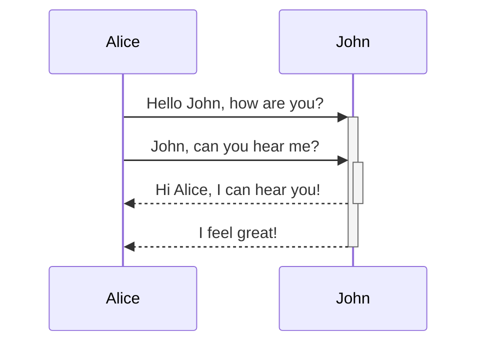

<div align="center"></div>

<br/>


<!-- NOTE-swimm-snippet: the lines below link your snippet to Swimm -->
### 📄 .gitignore
```gitignore
2      /node_modules
3      
4      # Production
5      /build
6      
7      # Generated files
8      .docusaurus
9      .cache-loader
10     
11     # As this is a template, we won't commit package-lock.json
12     # You should track this once it's created when you install.
13     package-lock.json
14     
15     # Misc
16     .DS_Store
```

<br/>

<!--MERMAID {width:100}-->

<!--MCONTENT {content: "sequenceDiagram<br/>\nAlice->>+John: Hello John, how are you?<br/>\nAlice->>+John: John, can you hear me?<br/>\nJohn\\-\\-\\>>-Alice: Hi Alice, I can hear you!<br/>\nJohn\\-\\-\\>>-Alice: I feel great!<br/>\n\n<br/>"} --->

<br/>

This file was generated by Swimm. [Click here to view it in the app](http://localhost:5002/repos/Z2l0aHViJTNBJTNBTm9hUmVwbyUzQSUzQU5vYW96ZXI=/docs/z04tp).
