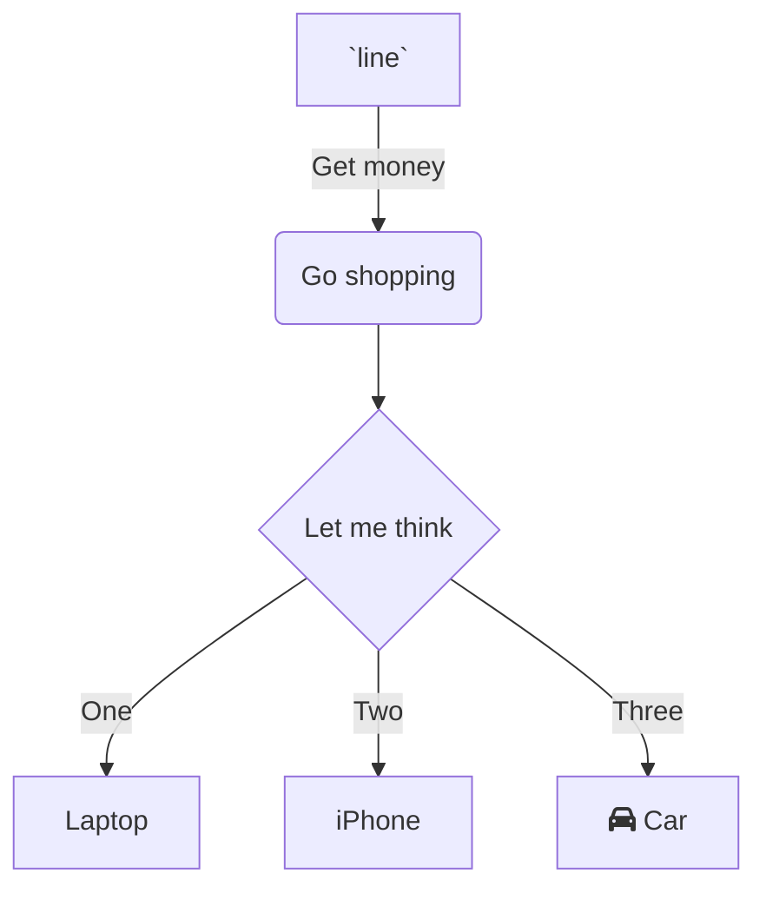

rgthyjukiuyfghjertdg

<br/>

<!--MERMAID {width:100}-->

<!--MCONTENT {content: "graph TD<br/>\nA\\[`line`<swm-token data-swm-token=\":docs/Noa_autosync_test:4:0:0:`line 4 4 4  444 44 `\"/>\\] \\-\\-\\>|Get money| B(Go shopping)<br/>\nB \\-\\-\\> C{Let me think}<br/>\nC \\-\\-\\>|One| D\\[Laptop\\]<br/>\nC \\-\\-\\>|Two| E\\[iPhone\\]<br/>\nC \\-\\-\\>|Three| F\\[fa:fa-car Car\\]<br/>\n\n<br/>"} --->

<br/>

```
tyujghjnm, gr  dfg
```

`line`<swm-token data-swm-token=":docs/Noa_autosync_test:4:0:0:`line 4 4 4  444 44 `"/> `line`<swm-token data-swm-token=":docs/Noa_autosync_test:4:0:0:`line 4 4 4  444 44 `"/> `line`<swm-token data-swm-token=":docs/Noa_autosync_test:4:0:0:`line 4 4 4  444 44 `"/>

`LineNOA`<swm-token data-swm-token=":docs/Noa_autosync_test:1:2:2:`Line LineNOA linee.Noaa `"/>

<br/>

<br/>

tyju
<!-- NOTE-swimm-snippet: the lines below link your snippet to Swimm -->
### 📄 docs/Noa_autosync_test
```
2      
3      
4      line 4 4 4  444 44 
5      
6      
```

<br/>

This file was generated by Swimm. [Click here to view it in the app](https://swimm-web-app.web.app/repos/Z2l0aHViJTNBJTNBTm9hUmVwbyUzQSUzQU5vYW96ZXI=/docs/8vxvmwkc).
